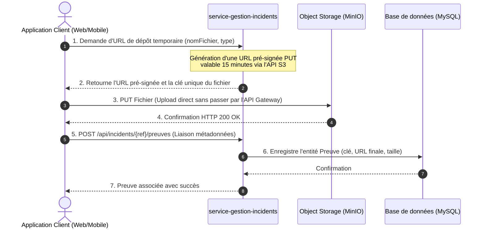

# Guide de Conception : Stockage et Gestion des Preuves d'Incidents (SGITU)

Ce guide décrit l'architecture, l'implémentation et les meilleures pratiques pour la gestion et le stockage des **preuves (photos, vidéos, documents)** liées aux incidents dans le projet de microservices **SGITU** (Système de Gestion des Incidents du Transport Urbain). 

Il comprend également un guide de soutenance et de présentation spécialement conçu pour valoriser vos choix techniques devant vos professeurs.

---

## 1. Choix Architectural : Pourquoi l'Object Storage ?

Dans une architecture microservices comme SGITU (Spring Boot, Docker, MySQL, PostgreSQL, MongoDB, Kafka), la gestion des fichiers multimédia (preuves) présente des défis de scalabilité et de performance. Trois approches ont été analysées :

### Comparatif des Approches de Stockage

| Critère | Approche A : Stockage Local (Disque Conteneur / Volumes) | Approche B : Base de Données (BLOB) | Approche C : Object Storage (MinIO / S3) — **Recommandé** |
| :--- | :--- | :--- | :--- |
| **Scalabilité Horizontale** | ❌ Très difficile (nécessite des volumes partagés comme NFS ou GlusterFS). | ⚠️ Possible, mais dégrade fortement les performances de la base de données. |  Parfaite (MinIO/S3 est stateless pour les microservices). |
| **Persistance & Cycle de vie** | ❌ Risqué (si le conteneur est supprimé sans volume persistant, les données sont perdues). |  Sécurisé par les sauvegardes de la DB (backups volumineux). |  Robuste (politiques de rétention, versions, réplication intégrées). |
| **Performance (I/O)** | ⚠️ Moyen (surcharge le disque du serveur d'application). | ❌ Mauvais (bloque les connexions DB pour lire/écrire de gros volumes binaires). |  Excellent (déchargement du trafic de lecture/écriture). |
| **Indépendance Cloud/On-Prem**| ❌ Lié aux chemins disques locaux du serveur. |  Indépendant mais sous-optimal. |  Idéal (compatible API S3 standard, interchangeable avec AWS S3, GCP, ou Scaleway). |

> [!IMPORTANT]
> **Choix retenu : L'Object Storage (MinIO).**
> MinIO est une solution open-source de stockage d'objets haute performance compatible avec l'API AWS S3. Il fonctionne dans un conteneur léger au sein du réseau Docker, ce qui le rend parfait pour le développement local et la production sur site (on-premise).

---

## 2. Flux d'Upload : Approche Directe vs URL Pré-signée (Pre-signed URL)

Pour transférer un fichier du client (Mobile/Web) vers le stockage, il existe deux patterns :

### Option 1 : Upload par Proxy (Passage par le Microservice)
Le client envoie le fichier à `api-gateway`, qui le transmet à `service-gestion-incidents`, qui l'envoie enfin à MinIO.
*   **Avantage :** Simple à implémenter. Le microservice contrôle tout le flux en direct.
*   **Inconvénients :** Surcharge la bande passante et la mémoire de la passerelle et du microservice. Si 100 utilisateurs uploadent une vidéo de 10 Mo en même temps, le microservice s'effondre (Out Of Memory).

### Option 2 : URL Pré-signées (Le Pattern des Professionnels) — **Choix préconisé**
Le client demande un accès temporaire au microservice, puis charge le fichier directement sur MinIO.



#### Pourquoi ce choix valorise votre projet ?
*   **Déchargement Réseau (Network Offloading) :** Le microservice ne traite que du JSON léger. Les flux binaires lourds vont directement au serveur de stockage optimisé.
*   **Sécurité :** Le bucket MinIO reste **100% privé**. Les fichiers ne sont accessibles ou modifiables que via des jetons temporaires signés cryptographiquement.

---

## 3. Guide Technique d'Implémentation dans SGITU

Voici les étapes concrètes pour intégrer MinIO dans le microservice `service-gestion-incidents`.

### Étape 3.1 : Déclaration de MinIO dans `docker-compose.yml` (Racine)

Ajoutez le service suivant dans votre fichier `docker-compose.yml` global :

```yaml
  # ---------------------------------------------------------------
  # Stockage d'Objets Transverse (MinIO) - Stockage des Preuves
  # ---------------------------------------------------------------
  minio:
    image: minio/minio:RELEASE.2024-02-17T01-15-57Z
    container_name: sgitu-minio
    hostname: minio
    ports:
      - "9000:9000" # API S3
      - "9001:9001" # Console d'administration web
    environment:
      MINIO_ROOT_USER: ${MINIO_ROOT_USER:-sgituadmin}
      MINIO_ROOT_PASSWORD: ${MINIO_ROOT_PASSWORD:-sgitupassword123}
    volumes:
      - minio_data:/data
    command: server /data --console-address ":9001"
    networks:
      - sgitu-network

  # Script de création automatique du bucket "preuves-incidents" au démarrage
  minio-create-buckets:
    image: minio/mc:RELEASE.2024-02-17T01-52-32Z
    container_name: sgitu-minio-setup
    depends_on:
      - minio
    entrypoint: >
      /bin/sh -c "
      until (/usr/bin/mc alias set myminio http://minio:9000 sgituadmin sgitupassword123); do echo 'Waiting for MinIO...'; sleep 1; done;
      /usr/bin/mc mb --ignore-existing myminio/preuves-incidents;
      /usr/bin/mc policy set private myminio/preuves-incidents;
      exit 0;
      "
    networks:
      - sgitu-network
```

N'oubliez pas de déclarer le volume en bas du fichier :
```yaml
volumes:
  ...
  minio_data:
```

---

### Étape 3.2 : Ajout des Dépendances dans le `pom.xml` du Microservice

Pour Spring Boot 4.0 et Java 21, nous utilisons le SDK AWS S3 v2 officiel, standard de l'industrie :

```xml
<!-- Dans service-gestion-incidents/pom.xml -->
<dependencies>
    ...
    <!-- SDK AWS S3 pour interagir avec MinIO -->
    <dependency>
        <groupId>software.amazon.awssdk</groupId>
        <artifactId>s3</artifactId>
        <version>2.25.15</version>
    </dependency>
</dependencies>
```

---

### Étape 3.3 : Configuration dans `application.properties`

Ajoutez les propriétés suivantes dans `service-gestion-incidents/src/main/resources/application.properties` :

```properties
# CONFIGURATION MINIO / S3
minio.endpoint=http://localhost:9000
minio.access-key=sgituadmin
minio.secret-key=sgitupassword123
minio.bucket-name=preuves-incidents
minio.region=us-east-1
```

*(Note : Pour le déploiement Docker, utilisez les variables d'environnement dans le bloc `g9-service` du docker-compose avec `http://minio:9000` comme endpoint)*.

---

### Étape 3.4 : Classe de Configuration Java (`S3ClientConfig.java`)

Créez le Bean Spring pour le client S3 dans un nouveau package `config` :

```java
package com.sgitu.servicegestionincidents.config;

import org.springframework.beans.factory.annotation.Value;
import org.springframework.context.annotation.Bean;
import org.springframework.context.annotation.Configuration;
import software.amazon.awssdk.auth.credentials.AwsBasicCredentials;
import software.amazon.awssdk.auth.credentials.StaticCredentialsProvider;
import software.amazon.awssdk.regions.Region;
import software.amazon.awssdk.services.s3.S3Client;
import software.amazon.awssdk.services.s3.S3Configuration;

import java.net.URI;

@Configuration
public class S3ClientConfig {

    @Value("${minio.endpoint}")
    private String endpoint;

    @Value("${minio.access-key}")
    private String accessKey;

    @Value("${minio.secret-key}")
    private String secretKey;

    @Value("${minio.region}")
    private String region;

    @Bean
    public S3Client s3Client() {
        return S3Client.builder()
                .endpointOverride(URI.create(endpoint))
                .credentialsProvider(StaticCredentialsProvider.create(
                        AwsBasicCredentials.create(accessKey, secretKey)
                ))
                .region(Region.of(region))
                .serviceConfiguration(S3Configuration.builder()
                        .pathStyleAccessEnabled(true) // Nécessaire pour MinIO
                        .build())
                .build();
    }
}
```

---

### Étape 3.5 : Création du Service de Stockage (`StorageService.java`)

Ce service encapsulera la logique de génération des URLs pré-signées et d'interaction avec MinIO.

#### L'interface :
```java
package com.sgitu.servicegestionincidents.service;

import java.time.Duration;

public interface StorageService {
    /**
     * Génère une URL pré-signée pour téléverser un fichier directement vers MinIO.
     */
    String generatePreSignedUploadUrl(String objectKey, String contentType, Duration expiration);

    /**
     * Génère une URL pré-signée pour consulter/télécharger un fichier privé.
     */
    String generatePreSignedDownloadUrl(String objectKey, Duration expiration);

    /**
     * Supprime un objet du stockage.
     */
    void deleteObject(String objectKey);
}
```

#### L'implémentation :
```java
package com.sgitu.servicegestionincidents.service;

import org.springframework.beans.factory.annotation.Value;
import org.springframework.stereotype.Service;
import software.amazon.awssdk.services.s3.S3Client;
import software.amazon.awssdk.services.s3.model.DeleteObjectRequest;
import software.amazon.awssdk.services.s3.model.PutObjectRequest;
import software.amazon.awssdk.services.s3.model.GetObjectRequest;
import software.amazon.awssdk.services.s3.presigner.S3Presigner;
import software.amazon.awssdk.services.s3.presigner.model.PresignedGetObjectRequest;
import software.amazon.awssdk.services.s3.presigner.model.PresignedPutObjectRequest;
import software.amazon.awssdk.auth.credentials.AwsBasicCredentials;
import software.amazon.awssdk.auth.credentials.StaticCredentialsProvider;
import software.amazon.awssdk.regions.Region;

import jakarta.annotation.PostConstruct;
import jakarta.annotation.PreDestroy;
import java.net.URI;
import java.time.Duration;

@Service
public class StorageServiceImpl implements StorageService {

    private final S3Client s3Client;
    
    @Value("${minio.endpoint}")
    private String endpoint;

    @Value("${minio.access-key}")
    private String accessKey;

    @Value("${minio.secret-key}")
    private String secretKey;

    @Value("${minio.region}")
    private String region;

    @Value("${minio.bucket-name}")
    private String bucketName;

    private S3Presigner presigner;

    public StorageServiceImpl(S3Client s3Client) {
        this.s3Client = s3Client;
    }

    @PostConstruct
    public void init() {
        // Initialisation du Presigner S3
        this.presigner = S3Presigner.builder()
                .endpointOverride(URI.create(endpoint))
                .credentialsProvider(StaticCredentialsProvider.create(
                        AwsBasicCredentials.create(accessKey, secretKey)
                ))
                .region(Region.of(region))
                .build();
    }

    @Override
    public String generatePreSignedUploadUrl(String objectKey, String contentType, Duration expiration) {
        PutObjectRequest putObjectRequest = PutObjectRequest.builder()
                .bucket(bucketName)
                .key(objectKey)
                .contentType(contentType)
                .build();

        PresignedPutObjectRequest presignedRequest = presigner.presignPutObject(r -> r
                .signatureDuration(expiration)
                .putObjectRequest(putObjectRequest));

        return presignedRequest.url().toString();
    }

    @Override
    public String generatePreSignedDownloadUrl(String objectKey, Duration expiration) {
        GetObjectRequest getObjectRequest = GetObjectRequest.builder()
                .bucket(bucketName)
                .key(objectKey)
                .build();

        PresignedGetObjectRequest presignedRequest = presigner.presignGetObject(r -> r
                .signatureDuration(expiration)
                .getObjectRequest(getObjectRequest));

        return presignedRequest.url().toString();
    }

    @Override
    public void deleteObject(String objectKey) {
        DeleteObjectRequest deleteRequest = DeleteObjectRequest.builder()
                .bucket(bucketName)
                .key(objectKey)
                .build();
        s3Client.deleteObject(deleteRequest);
    }

    @PreDestroy
    public void cleanup() {
        if (presigner != null) {
            presigner.close();
        }
    }
}
```

---

### Étape 3.6 : Mise à jour de l'Entité `Preuve.java` et de son DTO

#### 1. Entité `Preuve.java` (Améliorée)
Adaptons l'entité pour stocker la clé d'objet unique (pour S3) et calculer la taille dynamique du fichier :

```java
// Dans com.sgitu.servicegestionincidents.model.entity.Preuve.java
// (Modifications par rapport au code existant)

private String fichier;      // Représentera le nom logique d'origine (ex: "accident_bus.jpg")
private String stockageKey;  // Clé S3 unique (ex: "incidents/2026/06/uuid-accident_bus.jpg")
private String urlStockage;  // URL complète d'accès temporaire
private Long tailleFichier;  // Taille en octets stockée à la création

@Override
public Long getTaille() {
    return this.tailleFichier != null ? this.tailleFichier : 0L;
}
```

#### 2. DTO de demande d'upload (`PreuveUploadRequest.java`)
```java
package com.sgitu.servicegestionincidents.dto.request;

import jakarta.validation.constraints.NotBlank;
import lombok.Data;

@Data
public class PreuveUploadRequest {
    @NotBlank(message = "Le nom du fichier est obligatoire")
    private String nomFichier;

    @NotBlank(message = "Le type MIME (content-type) est obligatoire")
    private String contentType;
    
    private String description;
}
```

#### 3. DTO de retour d'upload (`PreuveUploadResponse.java`)
```java
package com.sgitu.servicegestionincidents.dto.response;

import lombok.AllArgsConstructor;
import lombok.Data;

@Data
@AllArgsConstructor
public class PreuveUploadResponse {
    private String uploadUrl;     // URL pré-signée à appeler en PUT par le client
    private String stockageKey;   // Clé unique générée par le serveur à conserver pour l'enregistrement
}
```

---

### Étape 3.7 : Contrôleur REST (`PreuveController.java`)

Créez le contrôleur pour gérer l'initialisation de l'upload et l'accès sécurisé aux preuves :

```java
package com.sgitu.servicegestionincidents.controller;

import com.sgitu.servicegestionincidents.dto.request.PreuveUploadRequest;
import com.sgitu.servicegestionincidents.dto.response.PreuveUploadResponse;
import com.sgitu.servicegestionincidents.service.StorageService;
import org.springframework.http.ResponseEntity;
import org.springframework.web.bind.annotation.*;

import jakarta.validation.Valid;
import java.time.Duration;
import java.util.UUID;

@RestController
@RequestMapping("/api/incidents/preuves")
public class PreuveController {

    private final StorageService storageService;

    public PreuveController(StorageService storageService) {
        this.storageService = storageService;
    }

    /**
     * Étape A : Obtenir une URL pré-signée pour déposer un fichier.
     * Le client fera un PUT HTTP direct sur l'URL obtenue avec le binaire dans le corps.
     */
    @PostMapping("/request-upload")
    public ResponseEntity<PreuveUploadResponse> requestUploadUrl(@Valid @RequestBody PreuveUploadRequest request) {
        // Génération d'une clé unique pour éviter les collisions de noms de fichiers
        String uuid = UUID.randomUUID().toString();
        String extension = request.getNomFichier().substring(request.getNomFichier().lastIndexOf("."));
        String stockageKey = "preuves/" + uuid + extension;

        // URL valide pendant 15 minutes
        String uploadUrl = storageService.generatePreSignedUploadUrl(
                stockageKey, 
                request.getContentType(), 
                Duration.ofMinutes(15)
        );

        return ResponseEntity.ok(new PreuveUploadResponse(uploadUrl, stockageKey));
    }

    /**
     * Obtenir l'URL de téléchargement à la demande (valide 30 minutes) 
     * pour visualiser la photo ou la vidéo en toute sécurité.
     */
    @GetMapping("/download-url")
    public ResponseEntity<String> getDownloadUrl(@RequestParam String stockageKey) {
        String downloadUrl = storageService.generatePreSignedDownloadUrl(stockageKey, Duration.ofMinutes(30));
        return ResponseEntity.ok(downloadUrl);
    }
}
```

---

## 4. Comment Présenter ce Choix Technique au Professeur (Soutenance)

Les jurés de projets universitaires adorent voir des choix d'architecture justifiés par des **principes d'ingénierie logicielle solides** (et non par un simple "on a fait ça parce que c'est plus facile").

### Plan de Présentation Suggéré (Diapositives / Slides)

#### Slide 1 : Le Défi de la Gestion des Médias
*   **Problème :** Un incident de transport (panne de bus, accident) nécessite des preuves visuelles (photos, vidéos). Comment gérer ces fichiers lourds dans une architecture de 10 microservices ?
*   **Contrainte technique :** Éviter de saturer la base de données relationnelle et respecter le principe de conteneurs "stateless" (sans état) de Docker.

#### Slide 2 : Analyse Comparative & Choix Technologique
*   *Présenter le tableau comparatif du Chapitre 1 (Stockage Local vs DB vs Object Storage).*
*   **Justification du choix :** Intégration de **MinIO**, serveur de stockage d'objets open-source, compatible avec l'API AWS S3.
*   **Bénéfice :** Transition transparente vers le Cloud (AWS S3) en changeant uniquement 3 lignes de configuration (`application.properties`), sans toucher au code Java.

#### Slide 3 : Optimisation du Flux : Le Pattern "Pre-signed URL"
*   *Afficher le schéma de séquence Mermaid du Chapitre 2.*
*   **Explication clé :** Au lieu de saturer l'API Gateway et le microservice `service-gestion-incidents` avec de gros volumes de données binaires, le serveur délivre une signature cryptographique temporaire. Le client dépose le fichier directement sur MinIO.
*   **Avantage architectural :** Haute disponibilité, découplage réseau, sécurité par tokens à expiration rapide.

#### Slide 4 : Démo Live & Supervision
*   Montrer l'interface web de la console MinIO (port `9001`) avec les fichiers uploadés triés par buckets.
*   Montrer une requête Postman/Frontend où l'on récupère l'URL pré-signée temporaire et l'upload réussi.

---

### Questions Classiques du Jury & Réponses Clés

#### Q1 : "Pourquoi utiliser MinIO localement plutôt que de stocker directement sur AWS S3 ?"
*   **Réponse :** *"Pour trois raisons. Premièrement, pour l'**indépendance financière et hors-ligne** durant la phase de développement (pas besoin de carte bancaire ni d'abonnement cloud). Deuxièmement, MinIO implémente la même API standard S3 que AWS S3. Si nous passons en production sur AWS, il nous suffit de modifier l'adresse de l'endpoint dans le fichier `.env` ou `application.properties`. Le code applicatif reste 100% inchangé."*

#### Q2 : "Que se passe-t-il si un utilisateur demande une URL d'upload mais n'envoie jamais le fichier ?"
*   **Réponse :** *"C'est un problème classique d'objets orphelins. Nous y répondons par deux mécanismes de sécurité :*
    1. *L'URL pré-signée expire automatiquement après 15 minutes.*
    2. *Nous configurons une **politique de cycle de vie (Lifecycle Policy)** sur le bucket MinIO. Tout fichier qui n'a pas été formellement lié à un incident enregistré en base de données MySQL dans un délai de 24h est automatiquement purgé par un script cron ou une règle de nettoyage de MinIO."*

#### Q3 : "Comment assurez-vous que les preuves sont sécurisées et confidentielles ?"
*   **Réponse :** *"Le bucket MinIO est configuré en mode **Private**. Aucun accès direct par HTTP public n'est autorisé. Pour afficher une image ou une vidéo dans l'application, l'utilisateur connecté doit demander au microservice une URL de lecture pré-signée. Cette URL utilise une clé de signature temporaire (ex: valide 30 minutes). Ainsi, même si un lien de preuve fuite sur Internet, il devient inutilisable très rapidement."*

#### Q4 : "Votre base de données MySQL stocke-t-elle quand même des informations sur les fichiers ?"
*   **Réponse :** *"Oui, mais uniquement des **métadonnées légères**. Nous stockons le nom logique d'origine, le type MIME, la taille en octets et la clé d'objet unique MinIO (`stockageKey`). Cela permet de garder les tables SQL très légères et rapides à indexer, tout en garantissant des sauvegardes de base de données ultra-rapides."*
